<h1>ML Agents - Jumper Exercise</h1>

<h2>1. Setup project </h2>
We beginnen aan het project met een nieuw 3D Unity project op te zetten. Na je dit project voor de eerste keer opstart zal je via de package manager (Window>Package Manager) de ML Agents package nog moeten installeren. (We gebruiken voor dit project versie 2.0.1)

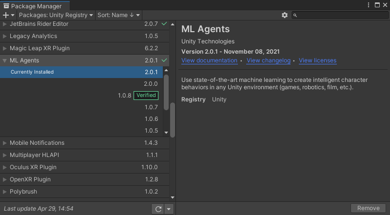

 
 

<h2>2. Scene </h2>
We zullen dan starten met een scene te maken. De scene zal een Plane en Kubus nodig hebben. De kubus zullen we gebruiken als onze Agent die zal gaan trainen. 

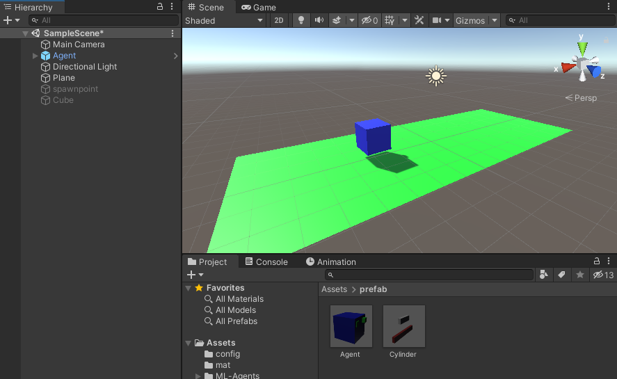

 
 

Ook maken we een prefab dat het obstakel en het puntenobject bevat. Deze prefab gaan we later gebruiken in een spawner script.

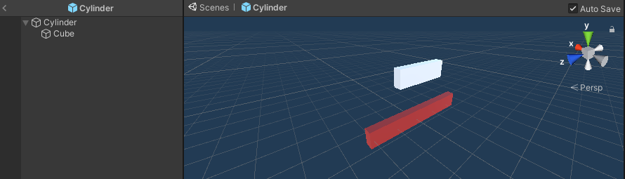

 
 

Als volgende stap voegen we enkele componenten toe aan de Agent. 

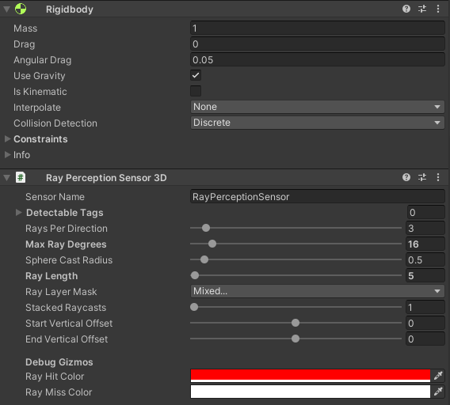
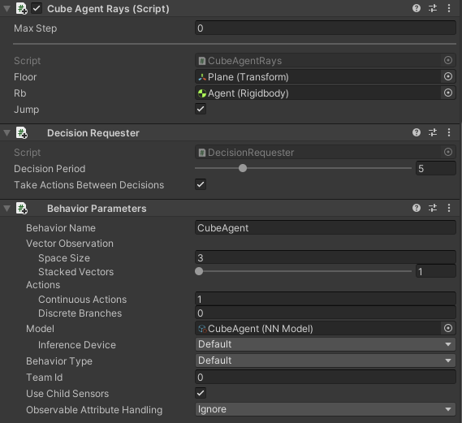

 
 

<h2>3. Scripts </h2>
<h3>3.1 Agent </h3>
Maak een script dat de Agent gaat besturen (CubeAgentRays). We importeren mlagents en erven over van Agent. 

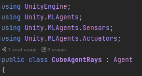

 
 

Met deze code zal bij elke nieuwe episode, in dit geval wanneer de agent een obstakel raakt, de agent terug op zijn beginlocatie gezet worden.

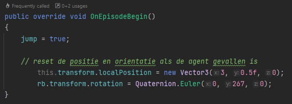

 
 

De CollectObservations methode hebben we ook nodig om de posities op te slaan.

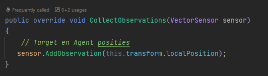

 
 

Onze OnActionReceived methode zal er voor zorgen dat de agent springt wanneer de jump variabele op true staat.

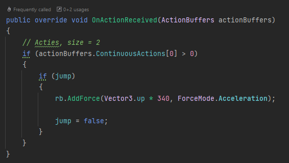

 
 

Ook passen we de Heuristic methode toe om onze Agent manueel te kunnen testen en laten springen. 

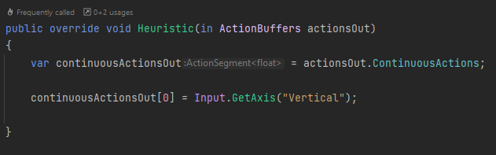

 
 

De volgende code zal wanneer het object waarmee de Agent in aanraking mee komt de tag 'obstacle' heeft de reward verminderen en het collision object verwijderen. Ook zal dit een nieuwe episode beginnen. 
Wanneer het object de tag 'point' heeft zal dit ook het collision object verwijderen maar dit keer de reward vermeerderen om zo de agent te trainen.

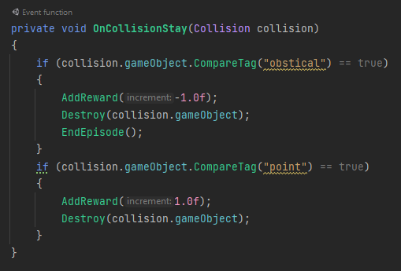

 
 

<h3>3.2 Spawner </h3>
Het volgende script zal voor het spawnen van de obstakels zorgen. We definieren hier een prefab die we in unity kunnen vullen met het eerdere obstakelprefab dat we hebben gemaakt. Ook zullen we een spawnlocatie definieren en een minimum en maximum tijd. 

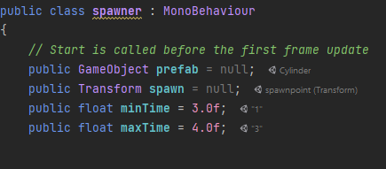

 

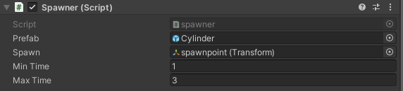

 
 

De start methode zal een random genereren om de obstakels een random tijd geven waarop ze moeten wachten om opnieuw te spawnen. De SpawnObstacle methode wordt hier aangeroepen en houdt het spawnen van de prefab in.

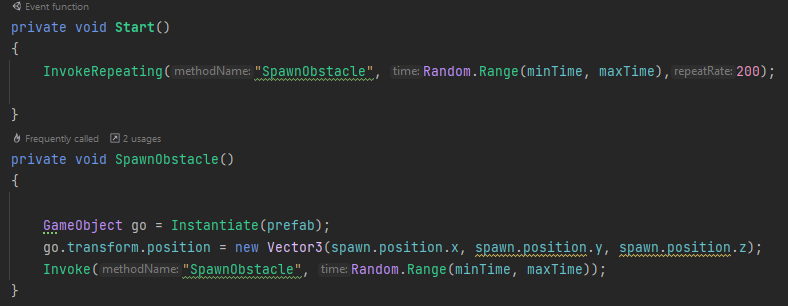

 
 

<h2>4 Obstakel </h2>
We maken nog een script om het gedrag van de obstakels te programmeren. Dit script voegen we toe aan de prefab van het obstakel. Deze code zal het obstakel laten bewegen en verwijderen wanneer het de onzichtbare muur achter de agent raakt.

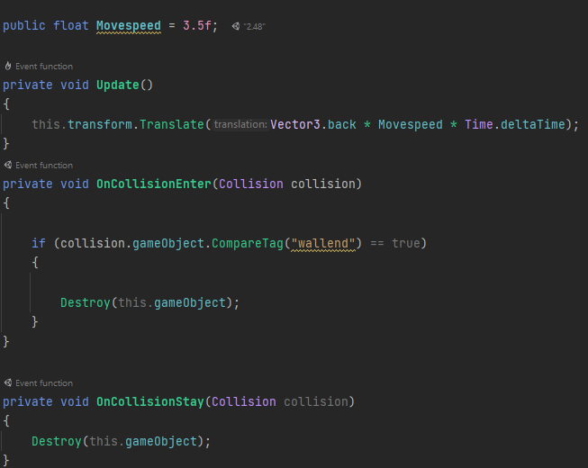

 
 

Deze onzichtbare muur voegen we nog toe, dit is een simpele kubus waar we de mesh renderer van uitzetten.

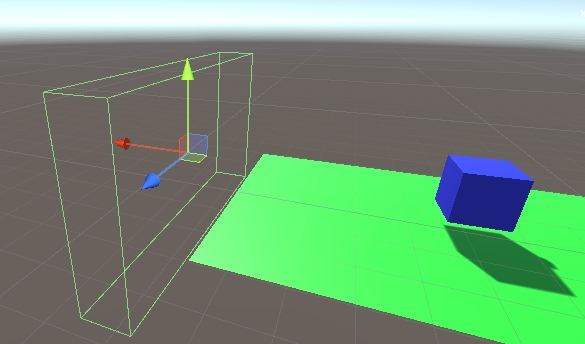

 

Jouw project is nu klaar om te beginnen met trainen. Veel succes!
